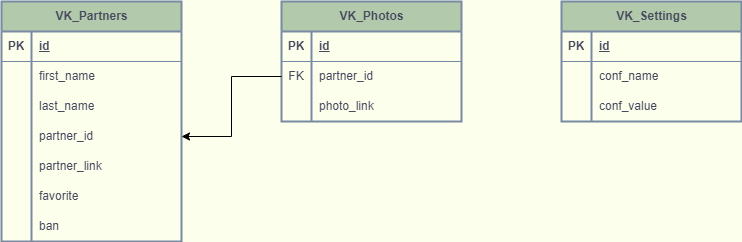

# Командный проект по курсу «Профессиональная работа с Python»

## ***VKinder***

## Цель проекта:

Цель командного проекта — разработать программу-бота для взаимодействия 
с базами данных социальной сети. Бот будет предлагать различные варианты 
людей для знакомств в социальной сети ВКонтакте в виде диалога с пользователем.

Вам предстоит:

* разработать программу-бота на Python,
* спроектировать и реализовать базу данных (БД) для программы,
* настроить взаимодействие бота с ВКонтакте,
* написать документацию по использованию программы.

В результате выполнения этого задания вы:

* получите практический опыт работы в команде;
* прокачаете навыки коммуникации и умение выполнять задачи в срок;
* закрепите навыки работы с GitHub и программирования на языке Python;
* разработаете с нуля полноценный программный продукт, 
который можно будет добавить в портфолио бэкенд-разработчика.

---

## Работа бота представлена на схеме:

---

## База данных бота представлена на схеме:

---

## Инструкция по работе с ботом:

1. Записываем в файл [password.ini](password.ini) соответствующие данные 
для работы с postgresSQL 
(`password` для `password=`, `name_bd` для `database=`, `user` для `user=`)
2. Запускаем исполняющий файл [main.py](main.py)
3. Вам будет предложено: `обновить данные Бота (VK_Settings)? y/n`. 
При первом запуске бота необходимо ввести `y` и далее ввести данные п.3, п.4, п.5.
Эти данные запишутся в таблицу `VK_Setting` и будут там храниться. 
При следующих запусках бота вводить `y` необходимо только для изменения данных 
п.3, п.4, п.5. Если эти данные изменять не требуется необходимо ввести `n`
4. Вам будет предложено: `Введите ID сообщества`
5. Вам будет предложено: `Введите токен группы`
6. Вам будет предложено: `Введите токен пользователя`
7. Переходим в ВК -> `сообщества` -> `выбираем нужное сообщество` -> `сообщение` -> 
`перейти к диалогу с сообществом` -> нажимаем кнопку `начать` или вводим в поле сообщения 
любой текст.
8. Вам будет предложено: `Введите нижний порог возраста:` 
9. Вам будет предложено: `Введите верхний порог возраста:` 
10. Программа осуществляет поиск пользователей в диапазоне от нижнего 
до верхнего порога возраста. При наличии записывает данные по пользователям в 
базу данных. Если вариантов не нашлось выдается сообщение 
`Пользователей с указанными параметрами не найдено.`. После чего необходимо нажать
кнопку `закрыть` и повторить поиск например расширив диапазон возраста или закончить.
11. Если пользователи нашлись, будет выведено соответствующее сообщение и показан
процесс загрузки их в базу данных
12. После завершения загрузки будет выведено сообщение 
`Вот что нашел Бот (пользователей - ***):`
13. Далее будет показан первый пользователь и три его фотографии.
14. Пользователь бота может совершать следующие действия 
путем нажатия соответствующих кнопок:
* Посмотреть следующего пользователя
* Посмотреть предыдущего пользователя
* Добавить пользователя в избранное
* Добавить пользователя в черный список
* Показать список избранных
* Закрыть (далее возможно повторить поиск или закончить)

---

## Состав проекта:

1. Исполняющий файл [main.py](main.py)
2. Модуль [work_bd.py](work_bd.py) работы с базой данных
3. Модуль [VK_bot_keyboard.py](VK_bot_keyboard.py) работы с кнопками
4. Файл [password.ini](password.ini) для работы с postgresSQL
5. Файл `VK_bot_flowchart (2).png` - изображение схемы работы бота
6. Файл `BD_picture.png` изображение схемы базы данных
7. Файл [BD_scheme.drawio](BD_scheme.drawio) - схема работы бота
8. Файл [VK_bot_flowchart (2).drawio](VK_bot_flowchart%20%282%29.drawio)- 
 схема базы данных
9. Файл [requirements.txt](requirements.txt) - импортированные библиотеки
10. Файл [README.md](README.md)
11. Файл [.gitignore](.gitignore)

